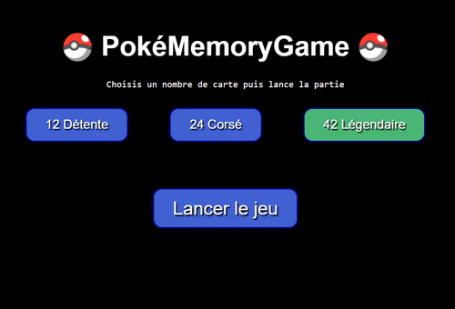
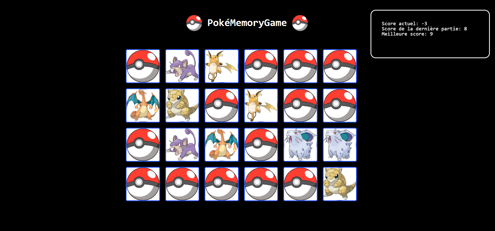

### To make me practice vanilla JavaScript, I realize this memory game application

**Quick description**
- different levels of difficulty relating to the number of cards in a game
- animated loading page
- random choice of image from a collection of images and random distribution of cards
- simple scoring system by points
- a modal is displayed at the end of the game to restart a game or to return to the homepage

**Area of improvment**
- improve design
- make it responsive
- add the possibility to return to the menu during the game 

<h1 align="center">Screenshots</h1>

 
    
    

 

